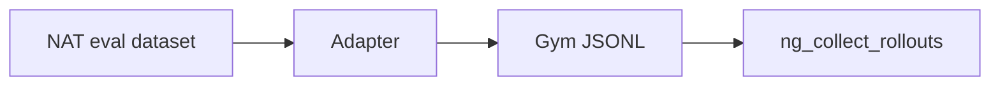
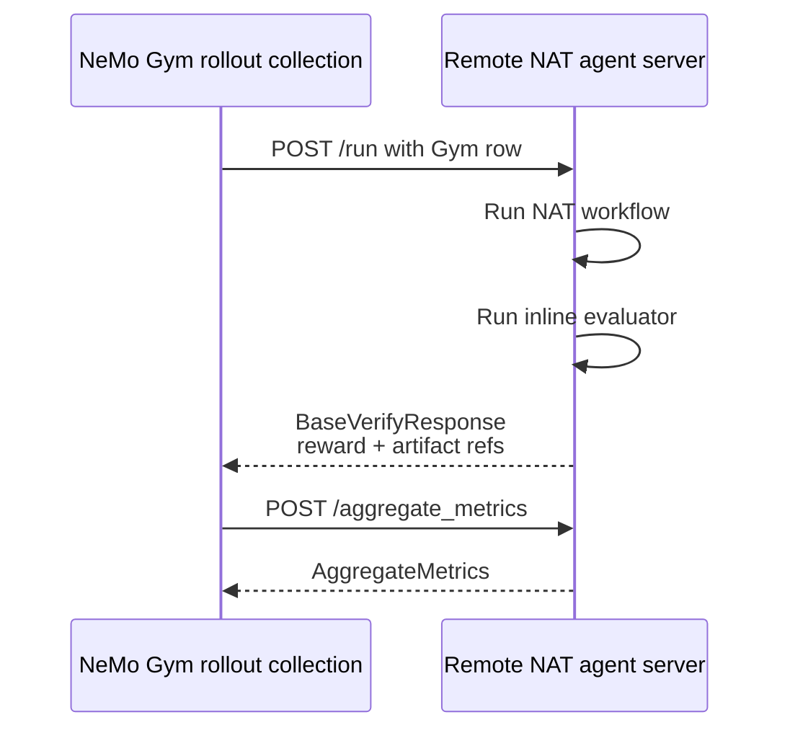

# NeMo Gym NAT POC

This is a small NeMo Gym compatibility smoke for NAT workflows. It mirrors the
MiniSWE-style Gym pattern: the agent server owns `/run`, executes the agent
harness, runs verification inline, returns a Gym `BaseVerifyResponse`-shaped
payload, and exposes `/aggregate_metrics` for rollout-level metrics.

In this POC, NAT is the agent server:

- `/v1/gym/run` is the explicit NAT endpoint.
- `/run` is the Gym-compatible alias.
- `/aggregate_metrics` computes aggregate reward metrics from verify responses.
- Evaluators run inside the NAT endpoint when `evaluator_name` is present.
- ATIF-native evaluators are preferred when an evaluator exposes
  `evaluate_atif_fn`; otherwise NAT falls back to the legacy evaluator lane.

## Models

The smoke config uses `nvidia/nemotron-3-nano-30b-a3b` for the calculator agent
workflow. The eval configs in this example use:

- `config-with-custom-post-process.yml`
  - workflow model: `meta/llama-3.1-70b-instruct`
  - judge model: `mistralai/mixtral-8x22b-instruct-v0.1`
  - evaluator: `tuneable_eval`
- `config-trajectory-eval.yml`
  - workflow model: `nvidia/nemotron-3-nano-30b-a3b`
  - judge model: `mistralai/mixtral-8x22b-instruct-v0.1`
  - evaluator: `trajectory_eval` with ATIF enabled

## Setup

Install the calculator workflow and the eval example into the active NAT venv:

```bash
uv pip install -e examples/getting_started/simple_calculator/
uv pip install -e examples/evaluation_and_profiling/simple_calculator_eval/
```

Set the NIM key expected by the configured `nim` LLMs:

```bash
export NVIDIA_API_KEY=<your_key>
```

## Gym Dataset

The simple calculator eval data has a Gym-shaped JSONL variant at:

```text
examples/evaluation_and_profiling/simple_calculator_eval/src/nat_simple_calculator_eval/data/nemo_gym_simple_calculator_tuneable_eval.jsonl
```



The adapter keeps the NAT eval task intent intact while reshaping each row into
the contract Gym can send to the NAT `/run` endpoint.

It adapts the 12 rows from
`examples/getting_started/simple_calculator/data/simple_calculator.json` into
the shape expected by `ng_collect_rollouts`:

- `responses_create_params.input` contains the calculator prompt.
- `expected_output_obj` carries the expected answer for the NAT evaluator.
- `evaluator_name` selects the inline NAT evaluator.
- `artifact_dir` tells the NAT endpoint where to write artifacts.

The rows intentionally omit `agent_ref`. For direct rollout collection, pass the
agent once with `+agent_name=nat_simple_calculator_agent`; Gym will attach that
agent reference to each row before calling `/run`.

This smoke does not require `ng_prepare_data`. For a training/validation data
pipeline, register the same JSONL in a Gym dataset config and let Gym materialize
the dataset in the normal data-prep flow.

## Run: Evaluator Reward

Start NAT with the custom post-process evaluator config:

```bash
.venv/bin/nat serve \
  --config_file examples/evaluation_and_profiling/simple_calculator_eval/src/nat_simple_calculator_eval/configs/config-with-custom-post-process.yml \
  --host 127.0.0.1 \
  --port 18000
```

In another terminal, send a Gym-shaped row:

```bash
curl -sS http://127.0.0.1:18000/v1/gym/run \
  -H 'content-type: application/json' \
  -d '{
    "id": 1,
    "_ng_task_index": 1,
    "evaluator_name": "tuneable_eval",
    "responses_create_params": {
      "model": "nat-simple-calculator-eval",
      "input": "What is the product of 3 and 7, and is it greater than the current hour?",
      "temperature": 0
    },
    "expected_output_obj": "Answer must have the answer of product of 3 and 7 and whether it is greater than the current hour",
    "artifact_dir": ".tmp/nat-gym/simple-calculator-eval"
  }' | tee .tmp/nat-gym/tuneable-run.json
```

Sample output shape, abbreviated:

```json
{
  "responses_create_params": {
    "model": "nat-simple-calculator-eval",
    "input": "What is the product of 3 and 7, and is it greater than the current hour?",
    "temperature": 0
  },
  "response": {
    "object": "response",
    "status": "completed",
    "output": [
      {
        "type": "message",
        "role": "assistant",
        "content": [
          {
            "type": "output_text",
            "text": "The product of 3 and 7 is 21..."
          }
        ]
      }
    ]
  },
  "reward": 0.86,
  "evaluator_details": {
    "mode": "evaluator",
    "evaluator_name": "tuneable_eval",
    "result": {
      "id": 1,
      "score": 0.86
    }
  },
  "artifact_refs": {
    "output_text": ".tmp/nat-gym/simple-calculator-eval/run-.../output.txt",
    "trajectory": ".tmp/nat-gym/simple-calculator-eval/run-.../trajectory.json",
    "evaluator_details": ".tmp/nat-gym/simple-calculator-eval/run-.../evaluator_details.json"
  }
}
```

Scores and wording vary by model response and judge output.

## Run: Gym Collector

The dataset above is enough for the Gym rollout collector, but Gym also needs a
head/global config that maps `nat_simple_calculator_agent` to the running NAT
FastAPI server at `127.0.0.1:18000`. With that server registration in place:



```bash
ng_collect_rollouts \
  +agent_name=nat_simple_calculator_agent \
  +input_jsonl_fpath=examples/evaluation_and_profiling/simple_calculator_eval/src/nat_simple_calculator_eval/data/nemo_gym_simple_calculator_tuneable_eval.jsonl \
  +output_jsonl_fpath=.tmp/nat-gym/simple-calculator-eval-rollouts.jsonl \
  +limit=1 \
  +num_repeats=1 \
  +num_samples_in_parallel=1 \
  +upload_rollouts_to_wandb=false
```

`ng_collect_rollouts` will:

- read the JSONL task row;
- attach `agent_ref.name=nat_simple_calculator_agent`;
- POST the row to `http://127.0.0.1:18000/run`;
- write the verified rollout JSONL;
- call `http://127.0.0.1:18000/aggregate_metrics` and write
  `.tmp/nat-gym/simple-calculator-eval-rollouts_aggregate_metrics.json`.

If the Gym head server is not registered yet, use the direct `curl` commands in
this README. They exercise the same `/run` and `/aggregate_metrics` contracts
without the collector routing layer.

## Run: ATIF Trajectory Evaluator

`config-trajectory-eval.yml` includes Phoenix tracing. Start Phoenix first if
you keep that config unchanged:

```bash
docker run -it --rm -p 4317:4317 -p 6006:6006 arizephoenix/phoenix:13.22
```

Then start NAT:

```bash
.venv/bin/nat serve \
  --config_file examples/evaluation_and_profiling/simple_calculator_eval/src/nat_simple_calculator_eval/configs/config-trajectory-eval.yml \
  --host 127.0.0.1 \
  --port 18000
```

Send the same style of row, but request `trajectory_eval`:

```bash
curl -sS http://127.0.0.1:18000/v1/gym/run \
  -H 'content-type: application/json' \
  -d '{
    "id": 1,
    "_ng_task_index": 1,
    "evaluator_name": "trajectory_eval",
    "responses_create_params": {
      "model": "nat-simple-calculator-trajectory-eval",
      "input": "What is the product of 3 and 7, and is it greater than the current hour?",
      "temperature": 0
    },
    "expected_output_obj": "Answer must have the answer of product of 3 and 7 and whether it is greater than the current hour",
    "artifact_dir": ".tmp/nat-gym/simple-calculator-trajectory-eval"
  }' | tee .tmp/nat-gym/trajectory-run.json
```

Sample evaluator portion, abbreviated:

```json
{
  "reward": 0.9,
  "evaluator_details": {
    "mode": "atif_evaluator",
    "evaluator_name": "trajectory_eval",
    "result": {
      "id": 1,
      "score": 0.9,
      "reasoning": {
        "trajectory": [
          [
            {
              "tool": "calculator__multiply",
              "tool_input": {
                "numbers": [3, 7]
              }
            },
            "21.0"
          ]
        ]
      }
    }
  }
}
```

The artifact trajectory is written as ATIF JSON and is the same trajectory passed
to the ATIF evaluator lane.

## Aggregate Metrics

Aggregate one or more returned verify responses:

```bash
jq -s '{verify_responses: .}' \
  .tmp/nat-gym/tuneable-run.json \
  .tmp/nat-gym/trajectory-run.json | \
curl -sS http://127.0.0.1:18000/aggregate_metrics \
  -H 'content-type: application/json' \
  -d @-
```

Sample output:

```json
{
  "group_level_metrics": [
    {
      "_ng_task_index": "1",
      "num_rollouts": 2,
      "mean_reward": 0.88
    }
  ],
  "agent_metrics": {
    "num_rollouts": 2,
    "num_scored_rollouts": 2,
    "mean_reward": 0.88
  },
  "key_metrics": {
    "mean_reward": 0.88
  }
}
```

This is the contract NeMo Gym rollout collection needs: each `/run` call returns
a verified response with reward, and `/aggregate_metrics` summarizes those
responses across tasks and rollouts.
