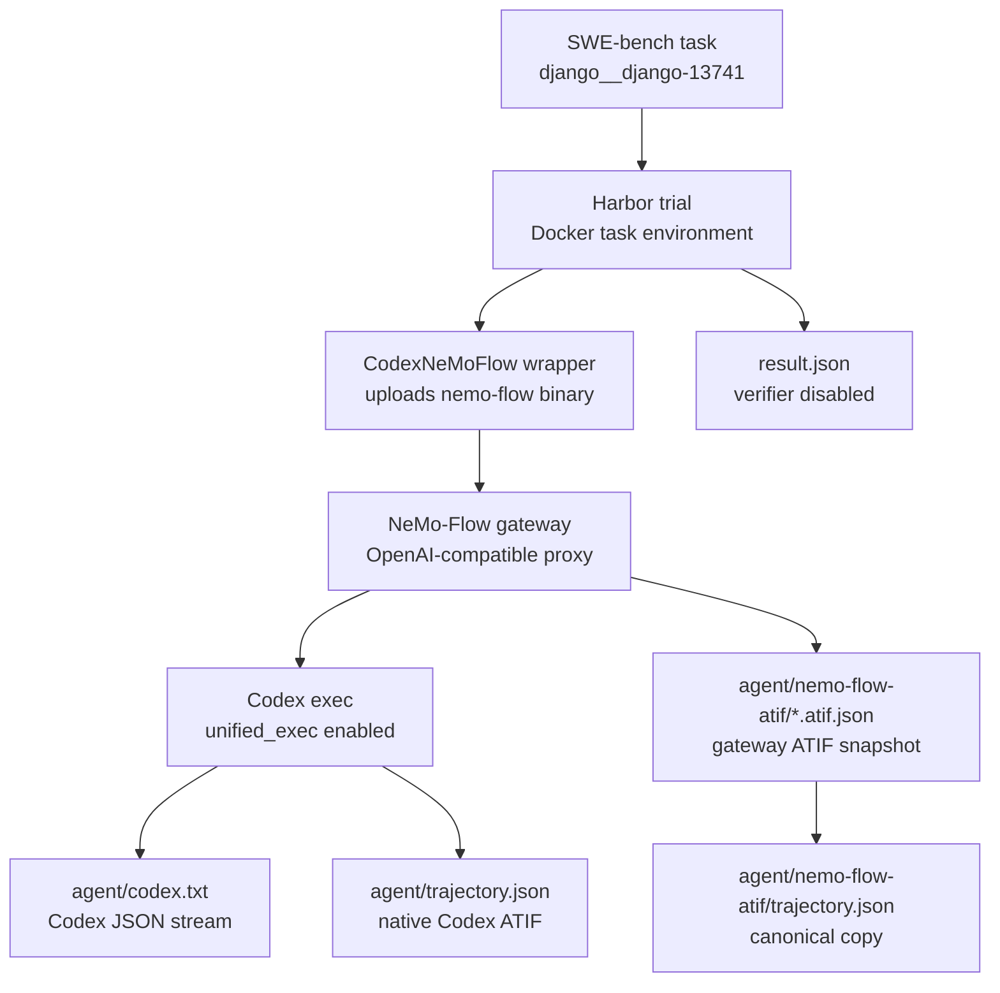

<!--
SPDX-FileCopyrightText: Copyright (c) 2026, NVIDIA CORPORATION & AFFILIATES. All rights reserved.
SPDX-License-Identifier: Apache-2.0

Licensed under the Apache License, Version 2.0 (the "License");
you may not use this file except in compliance with the License.
You may obtain a copy of the License at

http://www.apache.org/licenses/LICENSE-2.0

Unless required by applicable law or agreed to in writing, software
distributed under the License is distributed on an "AS IS" BASIS,
WITHOUT WARRANTIES OR CONDITIONS OF ANY KIND, either express or implied.
See the License for the specific language governing permissions and
limitations under the License.
-->

# Codex NeMo-Flow Harbor Smoke

This developer workflow validates one SWE-bench task through Harbor using Codex
behind the NeMo-Flow gateway. It is intentionally a one-task smoke: use it to
prove that the wrapper, NVIDIA OpenAI-compatible routing, and gateway ATIF
emission work before launching any larger SWE-bench shard.

The command below disables the offline verifier so the run measures agent setup,
agent execution, and trajectory emission only.

## Pipeline



## Prerequisites

- Docker is running.
- This repository is checked out to a branch containing
  `nat_harbor.agents.installed.codex_nemoflow:CodexNeMoFlow`.
- The NeMo-Flow checkout contains the Codex gateway fixes for:
  - injecting Codex `--config` after `codex exec`
  - avoiding duplicate `/v1` in OpenAI-compatible base URLs
  - stripping Codex `client_metadata` before upstream forwarding
  - preserving provider-required tool-result ordering
  - snapshotting open gateway sessions on shutdown

Clone the external Harbor and NeMo-Flow repositories and check out branches with
the local integration code.

<!-- path-check-skip-begin -->
```bash
mkdir -p external

if [ ! -d external/harbor/.git ]; then
  git clone https://github.com/AnuradhaKaruppiah/harbor.git external/harbor
fi
git -C external/harbor fetch origin
git -C external/harbor checkout ak-harbor-libary-mode

if [ ! -d external/nemo-flow/.git ]; then
  git clone https://github.com/AnuradhaKaruppiah/NeMo-Flow.git external/nemo-flow
fi
git -C external/nemo-flow fetch origin
git -C external/nemo-flow checkout ak-harbor-codex-testing
```

The SWE-bench smoke task should exist at:

```text
external/harbor/datasets/swebench-opencode-smoke/django__django-13741
```

If that task is missing, create it with Harbor's SWE-bench adapter:

```bash
cd external/harbor/adapters/swebench

uv run swebench \
  --instance-id django__django-13741 \
  --task-dir ../../datasets/swebench-opencode-smoke \
  --overwrite

cd ../../../..
```

Use an editable install for the local packages:

```bash
uv venv --python 3.13 --seed .venv
uv pip install -e packages/nvidia_nat_harbor
uv pip install -e external/harbor
.venv/bin/python - <<'PY'
import importlib.metadata as md
print("harbor", md.version("harbor"))
PY
```

Build a portable NeMo-Flow CLI binary. The static target avoids glibc version
mismatches inside SWE-bench task containers.

```bash
cd external/nemo-flow
rustup target add x86_64-unknown-linux-gnu
RUSTFLAGS='-C target-feature=+crt-static' \
  cargo build --release -p nemo-flow-cli --target x86_64-unknown-linux-gnu
./target/x86_64-unknown-linux-gnu/release/nemo-flow --help >/dev/null
cd ../..
```

The wrapper expects the binary at:

```text
external/nemo-flow/target/x86_64-unknown-linux-gnu/release/nemo-flow
```
<!-- path-check-skip-end -->

`NVIDIA_BASE_URL` should point at the OpenAI-compatible NVIDIA endpoint used
for this smoke:

```bash
export NVIDIA_BASE_URL=<openai-compatible-nvidia-base-url>
```

## Run One Task

Create a local environment file for the Docker task environment. Do not commit
this file.

<!-- path-check-skip-begin -->
```bash
mkdir -p .tmp/harbor/secrets
read -rsp 'NVIDIA_API_KEY: ' NVIDIA_API_KEY; echo
cat > .tmp/harbor/secrets/nvidia.env <<EOF
NVIDIA_API_KEY=${NVIDIA_API_KEY}
NVIDIA_BASE_URL=${NVIDIA_BASE_URL}
EOF
```

Run the one-task Codex NeMo-Flow smoke:

```bash
export HARBOR_JOBS_DIR=.tmp/harbor/codex-nemoflow-smoke
export SWEBENCH_TASK=external/harbor/datasets/swebench-opencode-smoke/django__django-13741
export NEMO_FLOW_REPO="$PWD/external/nemo-flow"
export JOB_NAME=codex-nemoflow-repeatable-smoke-1

set -a
. .tmp/harbor/secrets/nvidia.env
set +a

.venv/bin/harbor run \
  --path "$SWEBENCH_TASK" \
  -l 1 \
  --job-name "$JOB_NAME" \
  --jobs-dir "$HARBOR_JOBS_DIR" \
  --yes -n 1 --max-retries 0 \
  --env-file .tmp/harbor/secrets/nvidia.env \
  --agent-import-path nat_harbor.agents.installed.codex_nemoflow:CodexNeMoFlow \
  --env docker \
  --model nvidia/opus-frontier \
  --disable-verification \
  --ak nemo_flow_repo="$NEMO_FLOW_REPO" \
  --ak fail_missing_nemoflow_atif=true
```

Optional debugging flag:

```bash
--ak nemo_flow_debug_gateway=true
```

This writes gateway request and non-2xx upstream response bodies under
`agent/nemo-flow-atif/debug/`.
<!-- path-check-skip-end -->

Expected artifacts under the trial directory:

```text
agent/codex.txt
agent/trajectory.json
agent/nemo-flow-atif/*.atif.json
agent/nemo-flow-atif/trajectory.json
result.json
```

`agent/trajectory.json` is the native Codex ATIF derived from Codex session
events. `agent/nemo-flow-atif/trajectory.json` is the NeMo-Flow gateway ATIF
snapshot. Today the gateway artifact is best used to validate model-call
capture, token accounting, and unified ATIF emission; native Codex ATIF remains
the richer normalized tool-call artifact.

## Quick Artifact Check

Set `TRIAL` to the completed trial directory:

```bash
export HARBOR_JOBS_DIR=.tmp/harbor/codex-nemoflow-smoke
export JOB_NAME=codex-nemoflow-repeatable-smoke-1
export TRIAL
TRIAL=$(find "$HARBOR_JOBS_DIR/$JOB_NAME" -maxdepth 1 -type d -name 'django__django-13741__*' | head -n 1)
test -n "$TRIAL"
```

Check that the expected artifacts exist and that both trajectories load:

```bash
.venv/bin/python - <<'PY'
import json
import os
from pathlib import Path

trial = Path(os.environ["TRIAL"])
agent = trial / "agent"

for rel in (
    "codex.txt",
    "trajectory.json",
    "nemo-flow-atif/trajectory.json",
):
    path = agent / rel
    if not path.exists():
        raise SystemExit(f"Missing {path}")
    print("ok", rel, path.stat().st_size)

for rel in ("trajectory.json", "nemo-flow-atif/trajectory.json"):
    data = json.loads((agent / rel).read_text(encoding="utf-8"))
    metrics = data.get("final_metrics") or {}
    print(
        rel,
        data.get("schema_version"),
        "steps=",
        len(data.get("steps", [])),
        "prompt=",
        metrics.get("total_prompt_tokens"),
        "completion=",
        metrics.get("total_completion_tokens"),
    )

result = json.loads((trial / "result.json").read_text(encoding="utf-8"))
print("exception", result.get("exception_info"))
print("verifier", result.get("verifier_result"))
PY
```

Current sample result from a local one-task smoke:

| Item | Result |
|---|---|
| Total wall time | about 2m20s |
| Agent setup | about 34s |
| Agent execution | about 1m30s |
| Native Codex ATIF | `ATIF-v1.5`, 46 steps |
| NeMo-Flow gateway ATIF | `ATIF-v1.6`, 44 steps |
| Verifier | disabled |

## Remote One-Task Check

Use the same command shape on the remote Ubuntu host after syncing the branch,
editable installs, the `.tmp/harbor/secrets/nvidia.env` file, and the static
NeMo-Flow binary. Keep this to `-l 1` while validating the smoke.

```bash
ssh ubuntu@10.185.161.22 '
cd ~/projects/nat
export HARBOR_JOBS_DIR=.tmp/harbor/codex-nemoflow-smoke
export SWEBENCH_TASK=external/harbor/datasets/swebench-opencode-smoke/django__django-13741
export NEMO_FLOW_REPO=/home/ubuntu/projects/nat/external/nemo-flow
export JOB_NAME=codex-nemoflow-remote-smoke-1

.venv/bin/harbor run \
  --path "$SWEBENCH_TASK" \
  -l 1 \
  --job-name "$JOB_NAME" \
  --jobs-dir "$HARBOR_JOBS_DIR" \
  --yes -n 1 --max-retries 0 \
  --env-file .tmp/harbor/secrets/nvidia.env \
  --agent-import-path nat_harbor.agents.installed.codex_nemoflow:CodexNeMoFlow \
  --env docker \
  --model nvidia/opus-frontier \
  --disable-verification \
  --ak nemo_flow_repo="$NEMO_FLOW_REPO" \
  --ak fail_missing_nemoflow_atif=true
'
```

Current sample result from the remote one-task smoke:

| Item | Result |
|---|---|
| Total wall time | about 2m08s |
| Agent execution | about 1m34s |
| NeMo-Flow gateway ATIF | `ATIF-v1.6`, 46 steps |
| Verifier | disabled |

## Known Limitations

<!-- path-check-skip-begin -->
- This is a one-task trajectory smoke, not a full SWE-bench run.
- Use the static NeMo-Flow binary for SWE-bench Docker containers. A dynamic
  host binary can fail inside older task images with glibc version errors.
- The gateway ATIF currently records Codex model-call payloads and token usage,
  but does not yet normalize Codex function calls into top-level ATIF
  `tool_calls`. Use the native Codex ATIF for detailed tool sequence checks.
- First runs are slower because Harbor installs Codex inside the task
  environment. Subsequent runs on warm Docker layers should spend less time in
  agent setup.
<!-- path-check-skip-end -->
